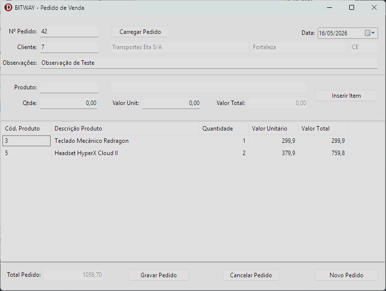

# BITWAY — Pedido de Venda

> Teste técnico para a vaga de **Analista Desenvolvedor Delphi** na Bitway Sistemas.

Repositório: https://github.com/fabioschunig/BITWAY-PedidoVenda

Aplicação desktop desenvolvida em **Delphi 12 CE** com persistência em **Firebird 3.0** via **FireDAC**, organizada em camadas (Repository/Service), seguindo Clean Code e queries 100% parametrizadas.

Links para ferramentas utilizadas:
- [Delphi 12 CE](https://www.embarcadero.com/br/products/delphi/starter/free-download)
- [Firebird 3.0](https://firebirdsql.org/en/firebird-3-0-13/)

### Detalhes extras

- [x] Etapa de evolução com implementação de **observação no pedido**
- [x] Arquivo SQL e exemplo de **migration** para evolução
- [x] Etapa de **correção** com ajuste no cálculo do valor total do pedido
- [x] Sem utilização de componentes de terceiros, conforme solicitado
- [x] Utilização de **componentes mais simples** do Delphi (TStringGrid ao invés de TDBGrid, por exemplo)
- [x] Bônus: Botão de **carregar** pedido
- [x] Bônus: Botão de **cancelar** pedido
- [x] Bônus: **Testes unitários** com DUnitX
- [x] **Commits detalhados** no Github com criação de PR para exemplificar processo de desenvolvimento
- [x] Documentação completa

---

## Índice

- [Pré-requisitos](#pré-requisitos)
- [Estrutura do projeto](#estrutura-do-projeto)
- [Criando o banco de dados](#criando-o-banco-de-dados)
- [Configurando o INI](#configurando-o-ini)
- [Executando o projeto](#executando-o-projeto)
- [Roteiro de testes manuais](#roteiro-de-testes-manuais)
- [Executando os testes unitários](#executando-os-testes-unitários)
- [Decisões técnicas relevantes](#decisões-técnicas-relevantes)

---

## Pré-requisitos

| Ferramenta | Versão mínima |
|---|---|
| Delphi | 10.4 Sydney ou superior |
| Firebird Server | 3.0 |
| fbclient.dll | 3.0 (incluída em `/bin`) |

---

## Estrutura do projeto

```
BITWAY-PedidoVenda/
│
├── bin/
│   ├── fbclient.dll               # Client library Firebird 3.0
│   └── config.ini.example         # Modelo de configuração
│
├── database/
│   ├── create-database.sql        # Cria o arquivo .fdb
│   ├── db.sql                     # DDL completo + carga de dados
│   └── migrations/
│       └── V002__add_observacao_pedido.sql   # (ilustrativo — ver nota abaixo)
│
└── src/
    ├── app/
    │   └── UMain                  # Tela principal (View)
    ├── connection/
    │   ├── UConfigINI             # Leitura do config.ini
    │   └── UDM                    # DataModule com TFDConnection
    ├── entities/
    │   ├── UEntityBase            # Classe base das entidades
    │   ├── UCliente
    │   ├── UProduto
    │   ├── UPedido                # Agrega TObjectList<TPedidoItem>
    │   └── UPedidoItem            # Auto-calcula VlrTotal nos setters
    ├── repositories/
    │   ├── URepositoryBase        # Base genérica com ObterPorCodigo/ValidarSeExiste
    │   ├── UClienteRepository
    │   ├── UProdutoRepository
    │   └── UPedidoRepository      # Gravar/Carregar/Excluir com transação
    ├── services/
    │   ├── UClienteService
    │   ├── UProdutoService
    │   └── UPedidoService         # Validações e orquestração
    └── tests/
        └── UPedidoVendaTests      # Testes unitários com DUnitX
```

---

## Criando o banco de dados

### 1. Criar o arquivo .fdb

Execute via **isql**, **FlameRobin** ou **IBExpert**, ajustando o caminho conforme seu ambiente:

```sql
CREATE DATABASE 'C:\BITWAY-PedidoVenda\database.fdb'
  USER 'SYSDBA' PASSWORD 'masterkey'
  PAGE_SIZE = 4096
  DEFAULT CHARACTER SET UTF8;
```

Ou use o arquivo pronto:

```
database/create-database.sql
```

### 2. Rodar o script DDL + carga

Com o banco criado, conecte nele e execute:

```
database/db.sql
```

O script cria:
- Sequences `SEQ_PEDIDO` e `SEQ_PEDIDO_ITEM`
- Tabelas `CLIENTE`, `PRODUTO`, `PEDIDO`, `PEDIDO_ITEM`
- Trigger de auto-incremento para `PEDIDO.NUMERO_PEDIDO`
- `PEDIDO_ITEM.ID` via `GENERATED BY DEFAULT AS IDENTITY` (Firebird 3.0 nativo)
- Índices e chaves estrangeiras
- 10 clientes e 10 produtos para teste

> **Atenção:** execute os scripts na ordem indicada. O `db.sql` pressupõe que o banco já existe.

### Sobre a migration V002

O arquivo `database/migrations/V002__add_observacao_pedido.sql` contém o `ALTER TABLE PEDIDO ADD OBSERVACAO VARCHAR(255)` e está presente de forma **ilustrativa**, para demonstrar o raciocínio de versionamento de schema (convenção de nomenclatura do Flyway).

O `db.sql` já inclui o campo `OBSERVACAO` no schema completo — **não é necessário executar a migration** para um setup do zero. Em um ambiente real com banco em produção, seria exatamente esse arquivo que aplicaria a evolução de forma controlada e rastreável, sem recriar o banco.

---

## Configurando o INI

Copie o arquivo de exemplo e renomeie:

```
bin/config.ini.example  →  bin/config.ini
```

Edite com os dados do seu ambiente:

```ini
[DATABASE]
Server=localhost
Port=3050
Database=C:\BITWAY-PedidoVenda\database.fdb
Username=SYSDBA
Password=masterkey
ClientLibrary=.\fbclient.dll
```

| Chave | Descrição |
|---|---|
| `Server` | IP ou hostname do servidor Firebird |
| `Port` | Porta TCP (padrão: 3050) |
| `Database` | Caminho completo do arquivo `.fdb` |
| `Username` | Usuário do banco |
| `Password` | Senha do usuário |
| `ClientLibrary` | Caminho para o `fbclient.dll` |

> O `fbclient.dll` do Firebird 3.0 está incluído em `/bin`. Se preferir usar o instalado localmente, aponte para `C:\Program Files\Firebird\Firebird_3_0\fbclient.dll`.

> O `config.ini` deve estar na **mesma pasta do executável**.

---

## Executando o projeto

### Via Delphi IDE

1. Abra o group project: `src/grpPedidoVenda.groupproj`
2. Defina `PedidoVenda` como projeto ativo
3. Certifique-se de que o `config.ini` está no diretório de saída (ex: `src/Win32/Debug/`)
4. Compile e execute (`F9`)

### Via executável compilado

1. Reúna em uma mesma pasta: `PedidoVenda.exe`, `fbclient.dll` e `config.ini`
2. Execute o `PedidoVenda.exe`

---

## Roteiro de testes manuais

### 1. Cliente inválido

1. No campo **Cód. Cliente**, informe um código inexistente (ex: `999`) e pressione TAB
2. **Esperado:** mensagem "Cliente não encontrado", campos de cliente permanecem vazios

---

### 2. Novo pedido completo

1. Clique em **Novo Pedido**
2. Informe `1` em **Cód. Cliente** e pressione TAB
3. **Esperado:** Nome, Cidade e UF preenchidos automaticamente (somente leitura)
4. Informe `1` em **Cód. Produto** e pressione TAB
5. **Esperado:** Descrição e Valor Unitário preenchidos automaticamente
6. Informe `2` em **Quantidade** e clique em **Inserir/Atualizar Item**
7. **Esperado:** item inserido no grid, total atualizado no rodapé
8. Preencha o campo **Observação** com algum texto
9. Clique em **Gravar Pedido**
10. **Esperado:** mensagem de sucesso com o número do pedido gerado — anote esse número

---

### 3. Produtos repetidos

1. Com um pedido aberto, informe o **mesmo código de produto** duas vezes com quantidades diferentes
2. **Esperado:** dois itens distintos no grid (linhas separadas), totais somados corretamente

---

### 4. Editar item via teclado (ENTER)

1. Com itens no grid, posicione o cursor sobre um item e pressione **ENTER**
2. **Esperado:** campos de produto/quantidade/valor preenchidos para edição
3. Altere a quantidade e clique em **Inserir/Atualizar Item**
4. **Esperado:** linha atualizada no grid, total do pedido recalculado

> O duplo clique no item também aciona a edição.

---

### 5. Excluir item via teclado (DEL)

1. Com itens no grid, selecione um item e pressione **DEL**
2. Confirme a exclusão
3. **Esperado:** item removido do grid e **total do pedido recalculado imediatamente**

---

### 6. Validações ao gravar

| Cenário | Esperado |
|---|---|
| Gravar sem informar cliente | Mensagem "Informe o cliente" |
| Gravar sem nenhum item | Mensagem "Pedido sem itens" |
| Gravar com valor total zero | Mensagem "Valor total inválido" |

---

### 7. Carregar pedido existente

1. Informe no campo **Nº Pedido** o número anotado no teste 2 e clique em **Carregar**
2. **Esperado:** cabeçalho, observação e itens carregados corretamente na tela

---

### 8. Cancelar pedido

1. Com um pedido carregado na tela, clique em **Cancelar Pedido** e confirme
2. **Esperado:** mensagem de sucesso, tela limpa
3. Tente carregar o mesmo número novamente
4. **Esperado:** mensagem "Pedido não encontrado"

---

## Executando os testes unitários

1. No Delphi IDE, defina `PedidoVendaTests` como projeto ativo no group project
2. Compile e execute (`F9`)
3. O runner do DUnitX exibe os resultados no console

**Cobertura:**

| Grupo | Casos |
|---|---|
| Item | Cálculo do total; recálculo ao alterar quantidade; recálculo ao alterar valor unitário; item com valor zero |
| Pedido | Total com múltiplos itens; recálculo após exclusão de item; produtos repetidos permitidos; total zero sem itens; valores fracionados |

---

## Decisões técnicas relevantes

**`TRepositoryBase<T>` com generics**
Base genérica que centraliza `ObterPorCodigo` e `ValidarSeExiste`, evitando duplicação de código entre `TClienteRepository` e `TProdutoRepository`. O `ValidarSeExiste` reutiliza `ObterPorCodigo` intencionalmente — o custo é idêntico ao de um `SELECT COUNT(1)` para buscas por PK com retorno de 0 ou 1 linha, e elimina a necessidade de uma segunda query escrita manualmente.

**`TPedidoItem` com self-calculation**
Os setters de `Quantidade` e `VlrUnitario` recalculam `VlrTotal` automaticamente via `RecalcularTotal`, garantindo que a entidade nunca fique em estado inconsistente independentemente de quem a manipule.

**Delete/insert dos itens no Atualizar**
Na operação de atualização do pedido, todos os itens existentes são excluídos e reinseridos dentro da mesma transação. Simplifica o controle de estado em tela sem abrir mão de atomicidade — em caso de falha, rollback garante consistência.

**`PEDIDO_ITEM.ID` com `GENERATED BY DEFAULT AS IDENTITY`**
Recurso nativo do Firebird 3.0, mais direto que sequence + trigger para esse caso. Para `PEDIDO.NUMERO_PEDIDO` foi mantida a sequence com trigger, pois o número precisa ser gerado e retornado explicitamente antes do INSERT (`NEXT VALUE FOR SEQ_PEDIDO`).

**Produtos repetidos**
Digitar um código de produto manualmente sempre insere uma nova linha no grid. A atualização de linha existente só ocorre quando o item foi carregado via ENTER (ou duplo clique) no grid. Comportamento documentado pois o requisito é ambíguo nesse ponto.

**Migration V002 ilustrativa**
O arquivo `database/migrations/V002__add_observacao_pedido.sql` representa como a evolução do campo `OBSERVACAO` seria entregue em produção com uma ferramenta de migration (Flyway, Liquibase). O `db.sql` já consolida o schema completo para facilitar o setup do zero — a migration não precisa ser executada nesse contexto.

**`TConfigINI` separado do DataModule**
A leitura do `config.ini` foi isolada em `TConfigINI` para separar a responsabilidade de configuração da de conexão. O `TfDM` consome o resultado e configura o `TFDConnection` dinamicamente — sem nenhuma credencial hardcoded no código ou no DFM.

---

## Tela de Pedido de Venda final



---
